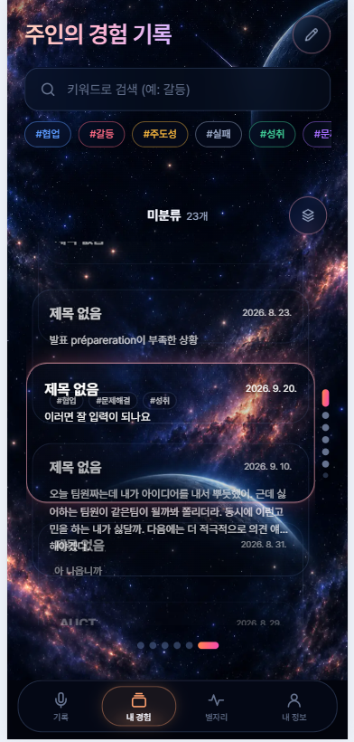

<div align="center">

# ECHO

**경험을 기록하고, 나를 발견하다.**

> Experience Capture & Human Observation
> 경험은 지나가지만, 그 안의 나는 다시 울려 돌아온다.

</div>

<br>

## 서비스 소개

대학생의 프로젝트·동아리·대외활동 경험은 그 순간이 지나면 빠르게 흐려집니다. 정작 자소서를 쓰거나 면접을 준비할 때가 되면 "내가 뭘 했더라"부터 막힙니다.

**ECHO는 경험이 사라지기 전에 붙잡아 두고, 나중에 다시 꺼내 쓸 수 있게 만드는 서비스입니다.**

텍스트나 음성으로 경험을 남기면 AI가 **상황·역할·갈등·행동·결과·감정**으로 구조화하고 태그를 붙입니다. 기록이 쌓이면 비슷한 경험들이 **별자리**로 모여, 내가 어떤 상황에서 어떻게 행동하는 사람인지 한눈에 보입니다.

하나의 경험은 별 하나이고, 비슷한 경험들이 모여 별자리가 되고, 시간이 지나면 그 별자리들이 "나는 어떤 사람인가"를 보여주는 개인의 우주가 됩니다.

### 여섯 개의 경험 별자리

기록은 다음 6가지 태그로 자동 분류되어 별자리를 이룹니다.

`#협업` &nbsp; `#갈등` &nbsp; `#주도성` &nbsp; `#실패` &nbsp; `#성취` &nbsp; `#문제해결`

### 핵심 기능

| 기능 | 설명 |
| --- | --- |
| **음성 · 텍스트 기록** | 말하거나 적기만 하면 됩니다. 브라우저 내장 Web Speech API로 실시간 전사 |
| **AI 경험 구조화** | 상황 / 역할 / 갈등 / 행동 / 결과 / 감정 / 이유 / 깨달음으로 자동 정리 |
| **태그 자동 분류** | 6종 경험 태그를 AI가 부여 |
| **별자리 탐색** | 태그별 별무리로 경험을 모아 보는 3D 인터랙션 |
| **프로젝트별 카드 뭉치** | 컬렉션 단위로 경험 카드를 넘겨 보기 |
| **STARWL 변환** | 면접·자소서용 경험 카드(Situation·Task·Action·Result·Why·Learning)로 변환 |

> **근거성 원칙** — 구조화·인사이트 결과는 항상 근거가 된 원본 기록과 함께 저장됩니다.
> ECHO는 기록에 실제로 남은 것만 이야기하며, MBTI 같은 고정 유형으로 사용자를 규정하지 않습니다.

<br>

## 화면

<div align="center">
  
  <p><i>내 경험 — 프로젝트별로 모인 경험 카드 뭉치</i></p>
</div>

<br>

## 기술 스택

### Frontend

| 분류 | 기술 |
| --- | --- |
| Language |  |
| Library |  |
| Bundler |  |
| Routing |  |
| Styling |  |
| 3D |  |
| STT |  |

### Backend & Infra

| 분류 | 기술 |
| --- | --- |
| BaaS |  |
| Database |  |
| Serverless |  |
| Hosting |  |

### AI

| 분류 | 기술 |
| --- | --- |
| Primary |  |
| Fallback |  |

LLM 호출은 **OpenRouter 무료 모델을 먼저 시도하고(비용 0원), 실패하면 Claude Haiku로 자동 폴백**합니다.
API 키는 서버리스 함수에서만 사용하며 프론트엔드 번들에 절대 포함되지 않습니다.

### Dev Tools

| 분류 | 기술 |
| --- | --- |
| Test |  |
| Lint |  |

<br>

## 시작하기

### 1. 의존성 설치

```bash
npm install
```

### 2. 환경 변수 설정

```bash
cp .env.example .env
```

| 변수 | 사용처 | 필수 |
| --- | --- | --- |
| `VITE_SUPABASE_URL` | 프론트엔드 (빌드에 포함됨) | ✅ |
| `VITE_SUPABASE_ANON_KEY` | 프론트엔드 (RLS로 보호되는 공개 키) | ✅ |
| `ANTHROPIC_API_KEY` | `/api` 서버리스 함수 전용 | ✅ |
| `OPENROUTER_API_KEY` | `/api` 서버리스 함수 전용 (무료 모델 1차 시도) | — |
| `OPENROUTER_MODEL` | 기본 무료 모델 override | — |

> ⚠️ `ANTHROPIC_API_KEY`와 `OPENROUTER_API_KEY`는 **절대 `VITE_` 접두사를 붙이지 마세요.**
> `VITE_` 변수는 프론트엔드 번들에 그대로 포함됩니다.

### 3. 데이터베이스 준비

Supabase 프로젝트의 SQL Editor에서 `supabase/schema.sql`을 실행해 테이블과 RLS 정책을 생성합니다.

### 4. 실행

```bash
npm run dev          # 프론트엔드만 (/api 호출은 실패)
npm run dev:vercel   # 프론트엔드 + /api 서버리스 함수 (Vercel CLI 필요)
```

<br>

## 개발 명령어

| 명령어 | 설명 |
| --- | --- |
| `npm run dev` | Vite 개발 서버 |
| `npm run dev:vercel` | Vercel CLI로 프론트 + `/api` 함께 실행 |
| `npm run build` | 타입체크(`tsc -b`) + 프로덕션 빌드 |
| `npm run typecheck:api` | `/api` 서버리스 함수 타입체크 |
| `npm run lint` | oxlint |
| `npm test` | Vitest 전체 실행 |

<br>

## 프로젝트 구조

```
api/                        Vercel 서버리스 함수 (키가 필요한 로직만)
├── _lib/
│   ├── llm.ts              LLM 호출 헬퍼 (OpenRouter → Claude 폴백)
│   ├── auth.ts             호출자 인증 (Supabase 세션 토큰 검증)
│   └── rateLimit.ts        사용자별 호출 제한
├── structure.ts            기록 → 구조화 + 태그
└── starwl.ts               구조화 데이터 → STARWL 변환

src/
├── pages/                  화면 단위 컴포넌트
│   ├── LandingPage.tsx     서비스 소개 랜딩 ("/")
│   ├── LoginPage.tsx       로그인 · 회원가입
│   ├── RecordPage.tsx      기록 (음성/텍스트)
│   ├── EntriesPage.tsx     내 경험 (프로젝트별 카드 뭉치)
│   ├── EntryDetailPage.tsx 경험 상세 · STARWL
│   ├── InsightsPage.tsx    별자리
│   └── ProfilePage.tsx     내 정보
├── components/
│   ├── landing/            랜딩 전용 (실제 앱 화면을 목업 안에 렌더)
│   ├── constellation/      3D 별자리 캔버스
│   ├── cosmic/             우주 배경 · 페이지 셸
│   ├── record/             녹음 오브
│   └── ui/                 GlassCard · TagChip · CosmicButton 등
└── lib/
    ├── supabaseClient.ts   Supabase 클라이언트 (anon key)
    ├── apiClient.ts        /api 호출 창구 (세션 토큰 자동 첨부)
    ├── routes.ts           라우트 경로 상수
    └── useAuth.ts          앱 전역 단일 세션 스토어

supabase/schema.sql         테이블 + RLS 정책
```

### 라우팅

| 경로 | 화면 |
| --- | --- |
| `/` | 서비스 소개 랜딩 (공개) |
| `/login` · `/signup` | 로그인 · 회원가입 |
| `/app` | 기록 |
| `/app/entries` · `/app/entries/:id` | 내 경험 · 경험 상세 |
| `/app/insights` | 별자리 |
| `/app/profile` | 내 정보 |

<br>

## 보안

- 클라이언트는 자기 Supabase 세션(anon key + RLS)으로 직접 읽고 씁니다. 모든 테이블에 `auth.uid() = user_id` RLS가 적용되며, `service_role` 키는 사용하지 않습니다.
- 요금이 발생하는 `/api` 엔드포인트는 **인증 → 호출 제한 → 입력 길이 검증** 3단 관문을 거칩니다.
- LLM API 키는 서버리스 함수의 `process.env`에서만 읽으며 프론트엔드로 전달되지 않습니다.

<br>

## 문서

| 문서 | 내용 |
| --- | --- |
| [`PRD_ECHO.md`](PRD_ECHO.md) | 원본 요구사항 (변경 금지, 항상 최신 기준) |
| [`CLAUDE.md`](CLAUDE.md) | 기술 구조 · 컨벤션 · API 보호 원칙 |
| [`ECHO_Business_Model.md`](ECHO_Business_Model.md) | 수익 모델 (Freemium + B2B2C) |
| [`design.md`](design.md) | 디자인 결정 기록 |

<br>

## 만들지 않는 것

스코프를 분명히 하기 위해 다음은 의도적으로 만들지 않습니다.

완성형 자소서 자동 작성 · 면접 음성 평가 · SNS/공유/랭킹 · MBTI식 고정 유형 분류 · 정신건강 진단이나 상담 · 외부 캘린더/학교 시스템 연동

<br>

<div align="center">
  <sub>ECHO — 작은 경험이 모여 특별한 나를 만듭니다.</sub>
</div>
